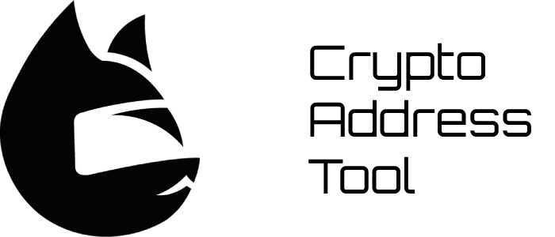

# Cryptro Address Tool



Validation tool Bitcoin and other Altcoin addresses on Go.

[See also the Python implementation.](https://github.com/nilptrr/crypto-address-tool)

## Supported currencies
| Currency      | Symbol | Mainnet | Testnet    | Note                                                                                                      |
|:-------------:| ------ | ------- | ---------- | ---------------------------------------------------------------------------------------------         |
| Bitcoin       | BTC    | +       | +          | P2PKH (Legacy Adresses), P2SH (Pay to Script Hash), P2WPKH (Native SegWit), P2TR (Taproot) address formats    |


## Installation
```
go get -u github.com/nilptrr/crypto-address-go@v0.1.2
```

## Usage
```go
validationResult := gocat.Validate(symbol, address)
```

## License
Logo by [Yulia Nikolaeva](https://www.behance.net/yulianikolaeva)

Font: Orbitron by [Matt McInerney](http://matt.cc/)

### Code
The Unlicense. See the LICENSE file for details.
